# Mermaid Diagram Patterns for Academic Research

Common diagram patterns for visualizing research concepts, processes, and relationships.

## Concept Hierarchies

### Theory Structure
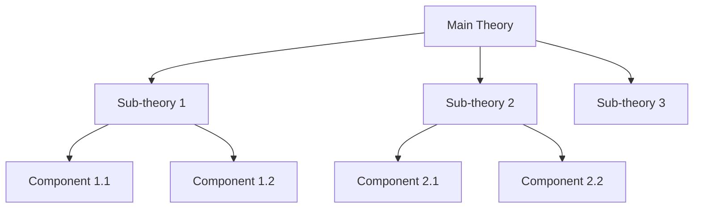

### Taxonomy
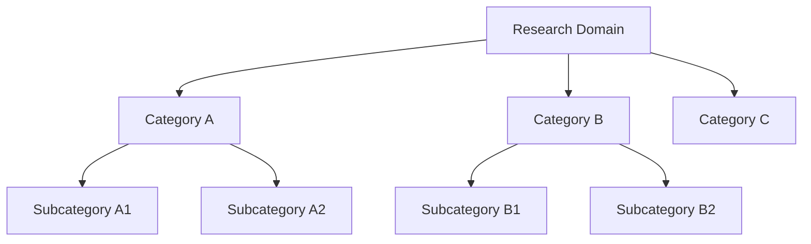

## Process Flows

### Research Methodology
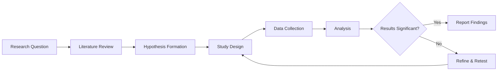

### Experimental Procedure
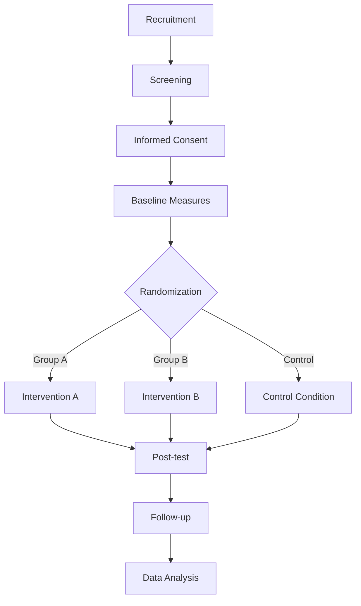

### Information Processing Model
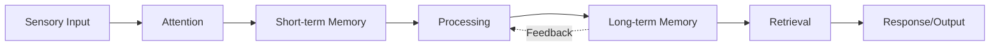

## Theoretical Relationships

### Causal Model
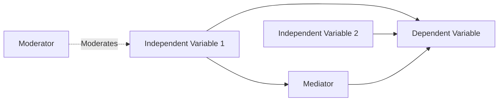

### Bidirectional Relationships
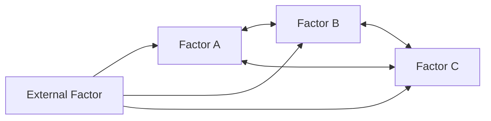

### Feedback Loop
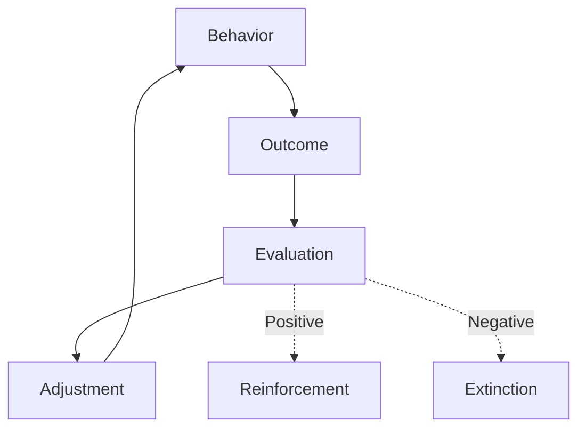

## Comparison Matrices

### Theory Comparison (as diagram)
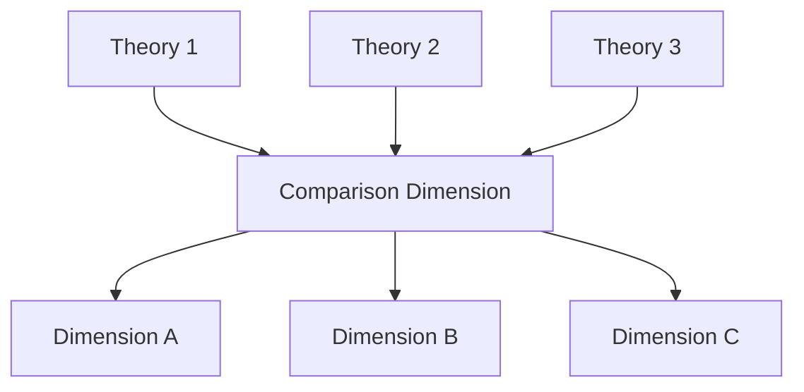

Note: For detailed comparisons, use tables instead of diagrams.

## Timelines

### Research History
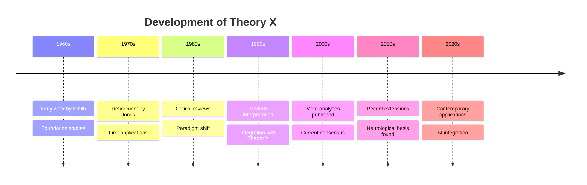

### Study Timeline
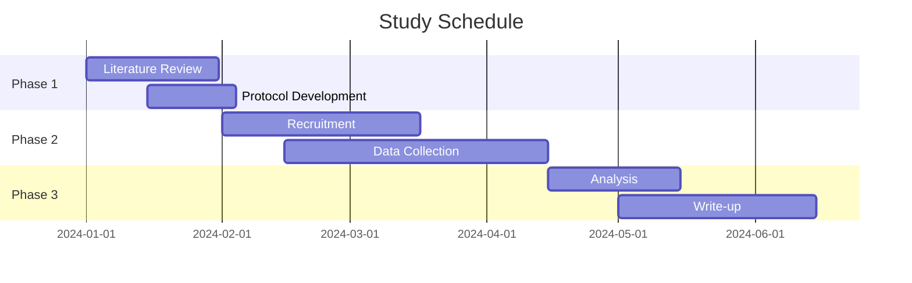

## State Diagrams

### Psychological States
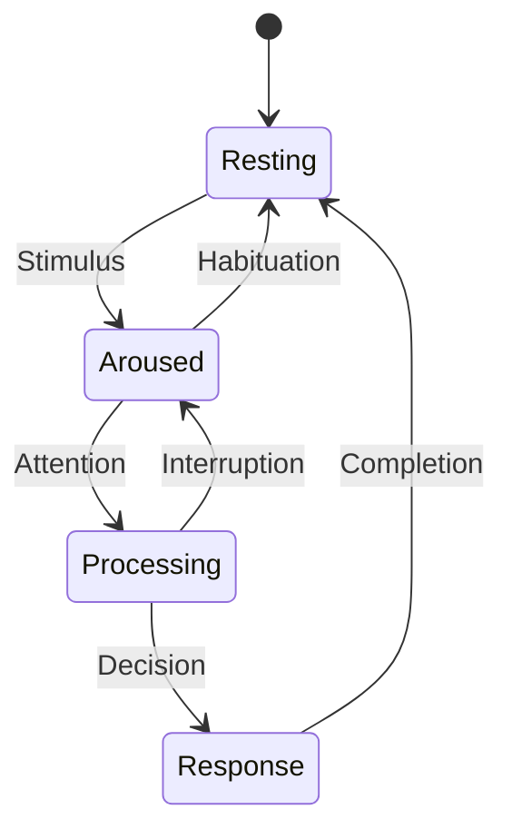

### Learning Stages
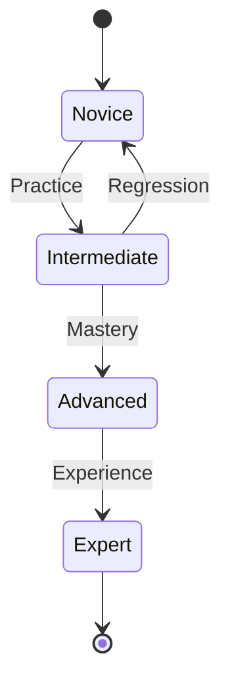

## Mind Maps / Concept Maps

### Research Domain
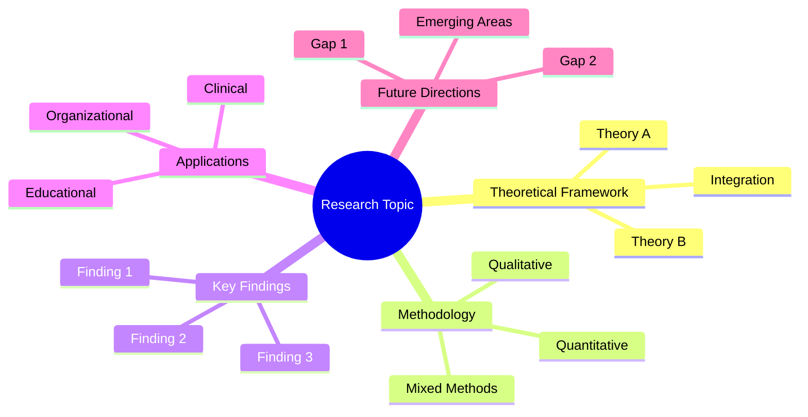

### Literature Synthesis
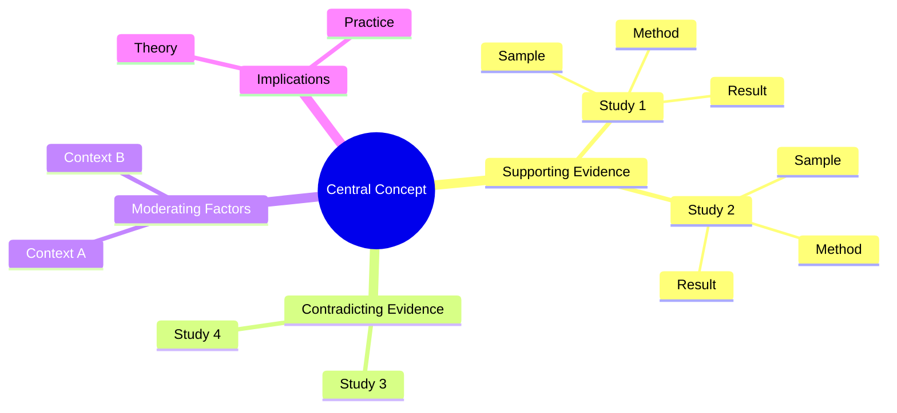

## Network Diagrams

### Citation Network (simplified)
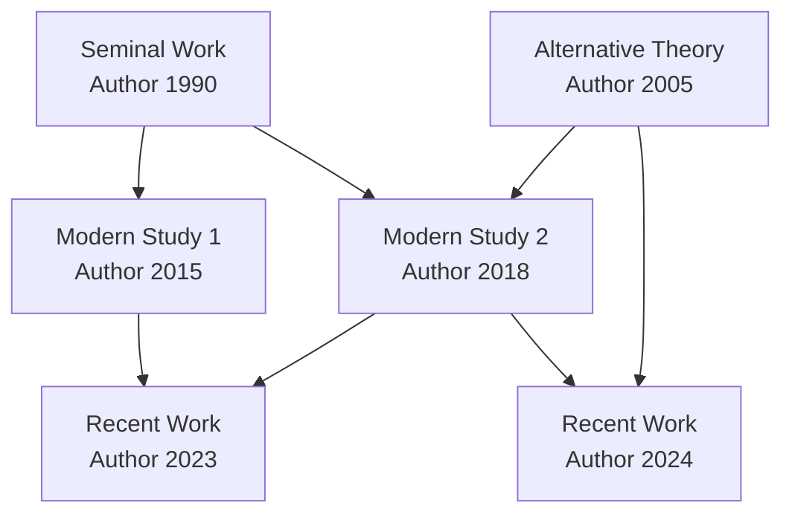

### Construct Relationships
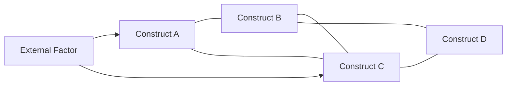

## Quadrant Charts

### Research Paradigms
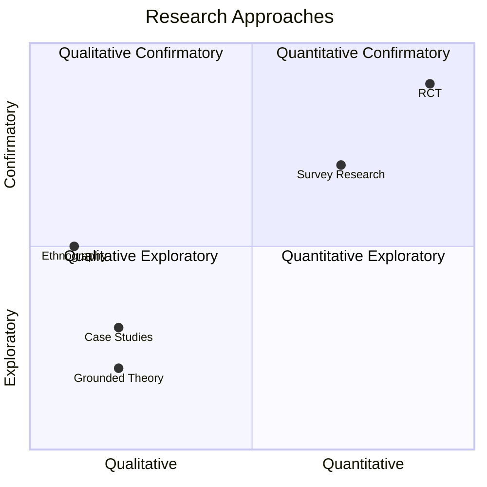

## Sequence Diagrams

### Cognitive Process
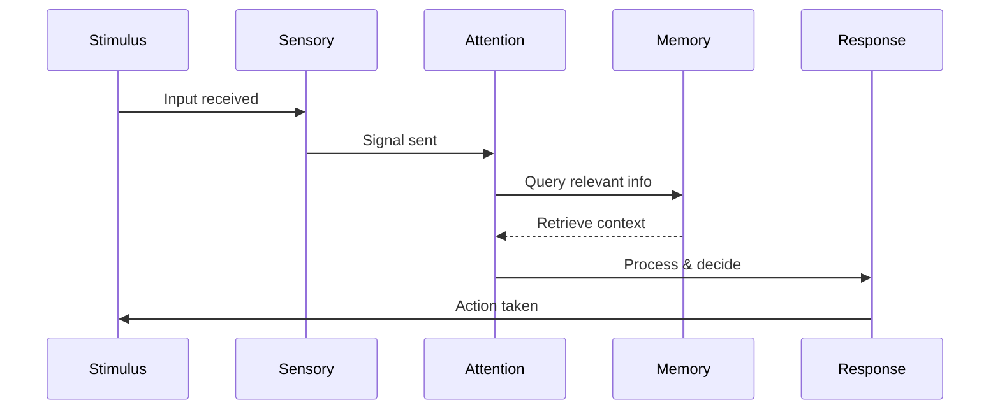

## Usage Guidelines

### When to Use Each Type

**Hierarchies**: Use for taxonomies, theory structures, categorizations
- Best for: Showing levels, containment, classification

**Process Flows**: Use for methodologies, procedures, causal sequences
- Best for: Step-by-step processes, decision trees, workflows

**Timelines**: Use for historical development, study schedules
- Best for: Chronological progression, development over time

**State Diagrams**: Use for stage transitions, psychological states
- Best for: Discrete states with transitions

**Mind Maps**: Use for brainstorming, topic overview, synthesis
- Best for: Radial organization, multiple dimensions

**Network Diagrams**: Use for citations, construct relationships
- Best for: Non-hierarchical connections, complex interactions

### Design Principles

1. **Keep it simple**: Maximum 10-12 nodes per diagram
2. **Clear labels**: Short, descriptive text
3. **Consistent direction**: Top-to-bottom or left-to-right
4. **Group related items**: Use subgraphs when helpful
5. **Use color sparingly**: Only to highlight key elements

### Common Mistakes to Avoid

❌ Too many nodes (>15)
❌ Unclear relationships
❌ Inconsistent terminology
❌ Missing legend when needed
❌ Overly complex connections

✅ Focused, single-purpose diagrams
✅ Clear directional flow
✅ Consistent labeling
✅ Legend for symbols/colors
✅ Hierarchical or sequential clarity

### Advanced Tips

**Subgraphs for grouping:**
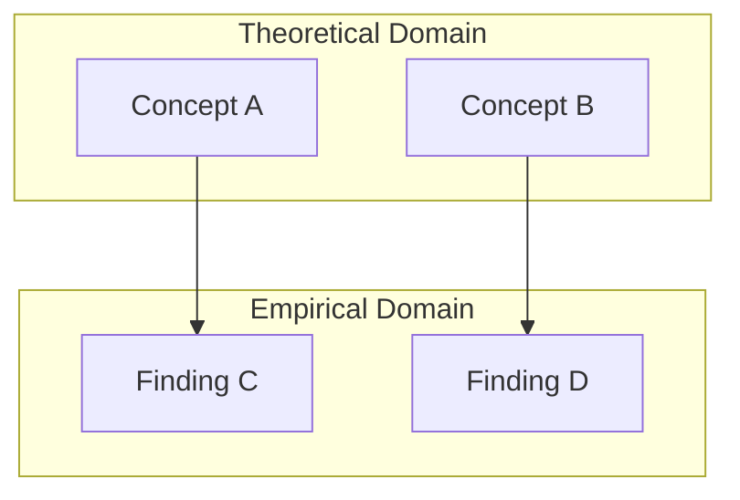

**Styling nodes:**
```mermaid
graph LR
    A[Normal]
    B[Emphasized]:::highlight
    C[Warning]:::warn
    classDef highlight fill:#e1f5ff,stroke:#0066cc
    classDef warn fill:#fff3cd,stroke:#ffc107
```

## When to Use Tables Instead

Use **tables** (not diagrams) for:
- Detailed comparisons with multiple dimensions
- Numerical data or statistics
- Study characteristics (sample sizes, methods, results)
- Side-by-side theory comparison with quotes

Use **diagrams** (not tables) for:
- Processes and workflows
- Hierarchies and relationships
- Temporal sequences
- Conceptual structures
