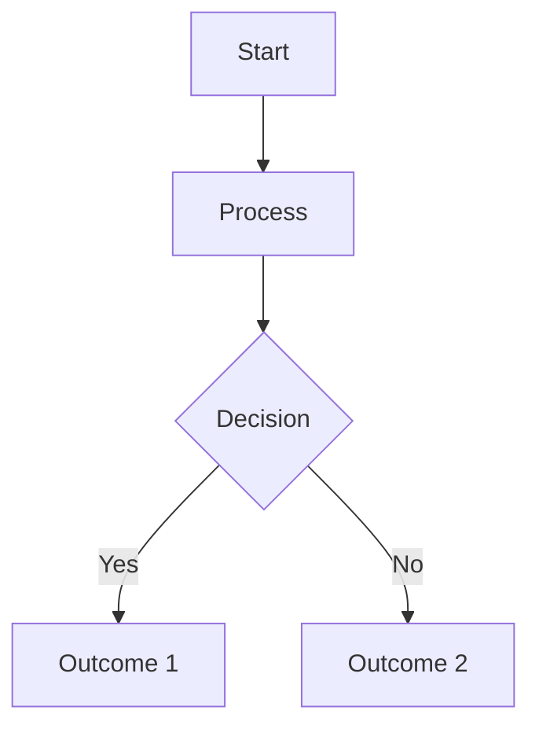

# English Research Note Template (Deep Research)

Use this structure for comprehensive literature coverage with 25-50+ sources.

```markdown
---
title: [Topic Title]
aliases: [Alternative names, abbreviations]
date: [YYYY-MM-DD]
last_updated: [YYYY-MM-DD]
tags: [discipline/subdiscipline, methodology/type]
language: en
source_count: [number]
quality_score: [1-5]
research_date: [YYYY-MM-DD]
mode: [comprehensive/focused/synthesis]
---

# [Topic Title]

## Visual Overview

```mermaid
mindmap
  root(([Topic Title]))
    Key Finding 1
      Evidence A
      Evidence B
    Key Finding 2
      Evidence C
      Evidence D
    Main Debate
      Position 1
      Position 2
    Applications
      Area A
      Area B
```

> [!abstract] Quick Reference
> • [Key point 1 - most important finding]
> • [Key point 2 - second major finding]
> • [Key point 3 - third key insight]
> • [Key point 4 if needed]

> [!note] Source Quality & Diversity
> 🟢 X high-impact | 🟡 X moderate | 🔴 X limited
> 📊 Source types: X journals, X meta-analyses, X books, X preprints
> 🌍 Geographic diversity: X continents, X countries
> 📅 Temporal range: YYYY-YYYY (X% within 5 years)
> 
> Drawing from X total sources

> [!info] Research Confidence Score: ⭐⭐⭐⭐☆ (4/5)
> - **Source quality:** [Assessment]
> - **Coverage:** [Assessment]
> - **Recency:** [Assessment]
> - **Consistency:** [Assessment]

> [!info] Citation Landscape
> **Foundational work:** [Author (Year)] — X+ citations
> **Most recent major work:** [Author et al. (Year)]
> **Key researchers:** [Names and focus areas]
> **Research centers:** [Regions/institutions]

## Research Questions

This note addresses:
1. [Primary research question]
2. [Secondary question]
3. [Additional questions]

## Overview

[Introduction - what it is, why it matters, historical context. 2-3 paragraphs.]

## Key Findings (🟢)

### [Subheading 1]

[Content with footnote citations.[^1]]

> [!tip] Key Takeaway
> [Important finding]

> [!info] Definition
> **[Term]**: [Explanation]

### [Subheading 2]

[Continuing content]

**Comparison Table:**

| Aspect | Theory A | Theory B | Theory C |
|--------|----------|----------|----------|
| Core claim | ... | ... | ... |
| Evidence | ... | ... | ... |
| Strengths | ... | ... | ... |
| Limitations | ... | ... | ... |

**Process Diagram:**



> [!warning] Limitation (🟡)
> [Constraint or uncertainty]

### [Subheading 3]

[Additional findings]

> [!example] Application
> [Concrete example]

## Discussion (🟢)

[Analysis of findings, implications, synthesis. 2-4 paragraphs.]

> [!warning] Active Debate
> **Position A:** [Description with proponents]
> **Position B:** [Description with proponents]
> **Current status:** [Where the field stands]

### Open Questions (🟡)

Research gaps:
- [Underexplored question]
- [Current gap - why it exists]
- [Area requiring more study]

## Related Topics

**Related notes in vault:**
- [[Related Note 1]] - [Connection]
- [[Related Note 2]] - [Connection]

**Research suggestions:**
- [[Topic A]] - [Why relevant]
- [[Topic B]] - [Why relevant]

## Summary (🟢)

[Synthesis of key points. Main takeaways. 1-2 paragraphs.]

## Suggested Next Steps

Based on identified gaps:

1. **Search:** "[specific search term]"
   - Focus: [What this addresses]
   
2. **Search:** "[specific search term]"
   - Focus: [What this addresses]

## Resources

**Follow-up searches:** 
- "[search 1]" - [Purpose]
- "[search 2]" - [Purpose]

**Key authors:** 
- [Name 1]: [Focus]
- [Name 2]: [Focus]

**Research groups:** [Institutions]

## Footnotes

[^1]: Author, A. A., & Author, B. B. (Year). Article title. *Journal Name*, volume(issue), pages. https://doi.org/xxxxx 🟢

[^2]: Author, C. C. (Year). Book title (Edition ed.). Publisher. 🟢

[^3]: Author, D. D. (Year). Conference paper. *Proceedings* (pp. X-Y). Publisher. 🟡

[^4]: Author, E. E. (Year). Preprint title. *Server*. https://doi.org/xxxxx 🔴

> [!abstract]- Research Process
> 
> **Initial assessment:**
> - Topic: [Narrow/Broad/Comparative]
> - Mode: [Comprehensive/Focused/Synthesis]
> - Target: X sources
> 
> **Searches:**
> - [Query 1] → [X results, Y relevant]
> - [Query 2] → [X results, Y relevant]
> 
> **Effective strategies:**
> - ✅ [What worked]
> - ✅ [What worked]
> 
> **Dead ends:**
> - ❌ [What didn't work]
> 
> **Filtering:**
> - X total sources found
> - Filtered to Y high-quality
> - Z excluded: [reason]
> 
> **Gaps:**
> - [Limited sources area]
> - [Missing perspectives]
> 
> **Lessons:**
> - [Insights for future]
> - [Productive databases/strategies]
```

## Usage Notes

**Confidence indicators in headers:**
- "## Key Findings (🟢)" - High confidence
- "## Discussion (🟡)" - Moderate confidence
- "### Open Questions (🟡)" - Limited evidence

**Footnote citations:**
- In text: `[^1]`, `[^2]`
- At end: `[^1]: Full citation 🟢`
- Obsidian auto-links them

**Tags:**
- NO # in YAML
- `tags: [psychology/cognitive, methodology/meta-analysis]`
- Obsidian adds # when rendering

**Wikilinks:**
- `[[Note Name]]` format
- Explain connection

**Visual overview:**
- Mindmap or flowchart
- 5-10 nodes max
- See `mermaid-patterns.md`
