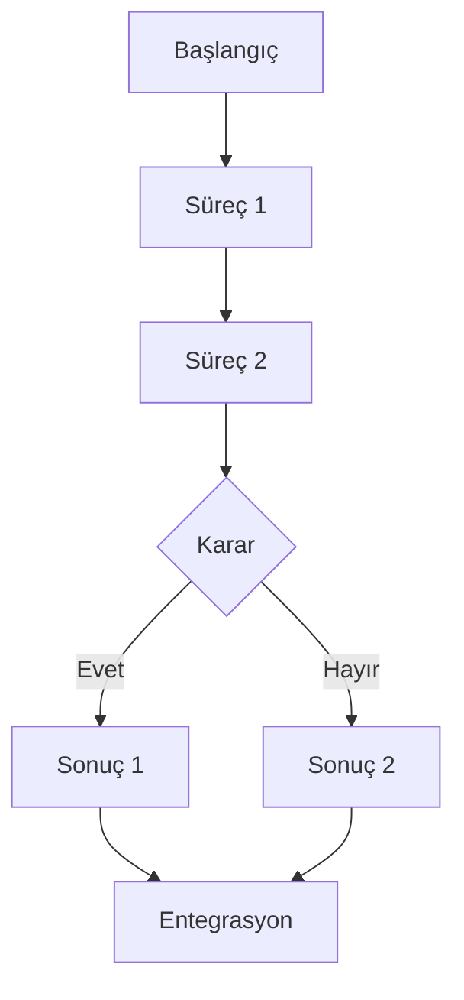

# Türkçe Araştırma Notu Şablonu (Derin Araştırma)

Kapsamlı literatür taraması için bu yapıyı kullanın.

```markdown
---
title: [Konu Başlığı]
aliases: [Alternatif isimler, kısaltmalar]
date: [YYYY-MM-DD]
last_updated: [YYYY-MM-DD]
tags: [disiplin/altdisiplin, metodoloji/tur]
language: tr
source_count: [sayı]
search_cycles: [döngü sayısı]
quality_score: [1-5]
research_date: [YYYY-MM-DD]
mode: [comprehensive/focused/synthesis/deep]
---

# [Konu Başlığı]

## Görsel Genel Bakış

```mermaid
mindmap
  root(([Konu Başlığı]))
    Ana Bulgu 1
      Kanıt A
      Kanıt B
    Ana Bulgu 2
      Kanıt C
      Kanıt D
    Temel Tartışma
      Görüş 1
      Görüş 2
    Uygulamalar
      Alan A
      Alan B
```

> [!abstract] Özet
> • [Ana nokta 1 - en önemli bulgu]
> • [Ana nokta 2 - ikinci önemli bulgu]
> • [Ana nokta 3 - üçüncü temel bulgu]
> • [Ana nokta 4]

> [!note] Kaynak Kapsamı ve Çeşitliliği
> 🟢 X yüksek etki | 🟡 X orta | 🔴 X sınırlı | **Toplam: X kaynak**
> 
> **Kaynak türleri:** X makale, X meta-analiz, X kitap, X konferans, X ön baskı
> **Coğrafi kapsam:** X ülke, X kıta temsil ediliyor
> **Zaman aralığı:** YYYY-YYYY (son 5 yılda %X)
> **Metodolojik çeşitlilik:** X RCT, X meta-analiz, X nitel, X teorik
> **Perspektif dengesi:** X destekleyici, X eleştirel, X alternatif
> 
> **Arama döngüsü:** X iteratif döngü gerçekleştirildi

> [!info] Araştırma Güven Skoru: ⭐⭐⭐⭐☆ (4/5)
> - **Kaynak kalitesi:** Mükemmel (%X yüksek etki)
> - **Kapsam:** Kapsamlı (küçük boşluklar: [alan])
> - **Güncellik:** Güçlü (son 3 yılda %X)
> - **Tutarlılık:** Yüksek (minimum çelişki)
> - **Perspektif çeşitliliği:** Dengeli (çoklu bakış açısı)

> [!info] Literatür Haritası
> **Temel eser:** [Yazar (Yıl)] — X+ atıf, alanı tanımladı
> **Önemli meta-analiz:** [Yazar ve diğ. (Yıl)] — X çalışma sentezi
> **En güncel çalışma:** [Yazar ve diğ. (Yıl)]
> **Önemli araştırmacılar:** [İsimler ve odak alanları]
> **Araştırma merkezleri:** [Bölgeler/kurumlar]
> **Teorik okullar:** [Farklı yaklaşımlar]

## Araştırma Kapsamı

Bu not aşağıdaki soruları ele almaktadır:
1. [Birincil araştırma sorusu]
2. [İkincil soru]
3. [Üçüncül soru]
4. [Ek sorular]

**Dahil etme kriterleri:** [Hangi çalışmalar dahil edildi]
**Hariç tutma kriterleri:** [Hangi çalışmalar hariç tutuldu]

## Genel Bakış (🟢)

[Konuya kapsamlı giriş - ne olduğu, önemi, tarihsel bağlam. 3-4 paragraf.]

## Ana Bulgular (🟢)

### [Ana Tema 1]

#### [Alt Başlık 1.1]

[Detaylı içerik. Dipnot atıflarıyla birlikte bulgular sunulur.[^1] Birden fazla kaynak aynı bulguyu destekliyorsa.[^2][^3]]

> [!tip] Temel Çıkarım
> [Önemli bulgu]

#### [Alt Başlık 1.2]

[Devam eden detaylı içerik]

### [Ana Tema 2]

[Her ana tema için benzer detaylı yapı]

**Karşılaştırma Tablosu:**

| Boyut | Yaklaşım A | Yaklaşım B | Yaklaşım C | Yaklaşım D |
|-------|------------|------------|------------|------------|
| Temel varsayım | ... | ... | ... | ... |
| Metodoloji | ... | ... | ... | ... |
| Kanıt gücü | X çalışma 🟢 | X çalışma 🟡 | X çalışma 🟢 | X çalışma 🟡 |
| Uygulama alanı | ... | ... | ... | ... |
| Güçlü yönler | ... | ... | ... | ... |
| Sınırlılıklar | ... | ... | ... | ... |

### [Ana Tema 3]

[Ek ana temalar]

**Süreç Diyagramı:**



> [!warning] Sınırlılık (🟡)
> [Metodolojik kısıt veya kavramsal belirsizlik]

## Tarihsel Gelişim (🟢)

### Erken Dönem (YYYY-YYYY)
[İlk çalışmalar, temel kavramlar, öncü isimler]

### Gelişme Dönemi (YYYY-YYYY)
[Yaygınlaşma, yeni uygulamalar, revizyonlar]

### Güncel Dönem (YYYY-günümüz)
[Son trendler, yeni yönelimler, gelecek tahminleri]

## Teorik Çerçeveler (🟢)

### Teori/Yaklaşım A
- **Temel iddia:** [...]
- **Önemli savunucular:** [İsimler]
- **Destekleyen çalışmalar:** X çalışma
- **Kanıt gücü:** [Değerlendirme]

### Teori/Yaklaşım B
[Benzer yapı]

### Yaklaşımların Karşılaştırması
[Sentez ve entegrasyon]

## Metodolojik Yaklaşımlar (🟡)

### Nicel Çalışmalar
- RCT: X çalışma → [Ana bulgular]
- Korelasyonel: X çalışma → [Ana bulgular]
- Meta-analiz: X çalışma → [Etki büyüklükleri]

### Nitel Çalışmalar
- Etnografik: X çalışma → [Ana bulgular]
- Fenomenolojik: X çalışma → [Ana bulgular]

### Karma Yöntem
- X çalışma → [Ana bulgular]

## Tartışma (🟢)

[Bulguların derinlemesine analizi, çıkarımlar, kaynaklar arası sentez. 4-6 paragraf.]

### Tutarlı Bulgular

Literatürde geniş uzlaşma olan noktalar:
- [Bulgu 1] - X çalışma destekliyor[^x][^y][^z]
- [Bulgu 2] - X çalışma destekliyor
- [Bulgu 3] - X çalışma destekliyor

### Çelişkili Bulgular (🟡)

> [!warning] Devam Eden Tartışma
> 
> **Tartışma Konusu:** [Konu]
> 
> **Görüş A:** [Açıklama]
> - Destekleyen: [Yazar 1, Yazar 2] - X çalışma
> - Kanıt: [Özet]
> 
> **Görüş B:** [Açıklama]  
> - Destekleyen: [Yazar 3, Yazar 4] - X çalışma
> - Kanıt: [Özet]
> 
> **Güncel durum:** [Uzlaşma yok / Kısmi uzlaşma / Gelişmekte]
> 
> **Olası açıklamalar:** [Metodolojik farklılıklar, bağlamsal faktörler, vb.]

### Eleştirel Perspektifler (🟡)

**Metodolojik eleştiriler:**
- [Eleştiri 1] - [Kaynak]
- [Eleştiri 2] - [Kaynak]

**Kavramsal eleştiriler:**
- [Eleştiri 1] - [Kaynak]
- [Eleştiri 2] - [Kaynak]

**Genel değerlendirme:** [Sentez]

## Uygulama Alanları (🟢)

### [Alan 1: örn. Eğitim]
**Mevcut uygulamalar:** [Örnekler]
**Kanıt:** X çalışma gösteriyor ki...[^x]
**Sınırlamalar:** [...]

### [Alan 2: örn. Klinik Pratik]
[Benzer yapı]

### [Alan 3]
[Ek alanlar]

## Araştırma Boşlukları (🟡)

### Metodolojik Boşluklar
- [Boşluk 1] - Neden var olduğu
- [Boşluk 2] - Potansiyel çözümler

### Kavramsal Boşluklar
- [Boşluk 1]
- [Boşluk 2]

### Bağlamsal Boşluklar
- [Boşluk 1: örn. batı-dışı bağlamlar]
- [Boşluk 2: örn. uzun-dönem etkiler]

## İlgili Konular

**Vault'taki ilgili notlar:**
- [[İlgili Not 1]] - [Nasıl bağlanıyor]
- [[İlgili Not 2]] - [Nasıl bağlanıyor]
- [[İlgili Not 3]] - [Nasıl bağlanıyor]

**Araştırma önerileri:**
- [[Konu A]] - [Neden önemli, ne keşfedilecek]
- [[Konu B]] - [Neden önemli, ne keşfedilecek]
- [[Konu C]] - [Neden önemli, ne keşfedilecek]

## Sentez ve Sonuç (🟢)

[Kapsamlı sentez. Ana bulgular, teorik katkılar, pratik çıkarımlar, gelecek yönelimler. 3-4 paragraf.]

**Anahtar çıkarımlar:**
1. [Çıkarım 1]
2. [Çıkarım 2]
3. [Çıkarım 3]
4. [Çıkarım 4]

## Önerilen Adımlar

Belirlenen boşluklara ve tartışmalara dayalı spesifik arama önerileri:

1. **Arama:** "[spesifik arama terimi 1]"
   - Odak: [Bu boşluğu dolduracak]
   - Hedef: [Ne bulunacak]
   
2. **Arama:** "[spesifik arama terimi 2]"
   - Odak: [Bu tartışmayı netleştirecek]
   - Hedef: [Ne bulunacak]

3. **Arama:** "[spesifik arama terimi 3]"
   - Odak: [Bu yeni trendi keşfedecek]
   - Hedef: [Ne bulunacak]

## Kaynaklar

**Ek aramalar:** 
- "[arama 1]" - [Hangi yön için]
- "[arama 2]" - [Hangi yön için]
- "[arama 3]" - [Hangi yön için]

**Takip edilecek yazarlar:** 
- [İsim 1]: [Araştırma odağı, son çalışmaları, kurumu]
- [İsim 2]: [Araştırma odağı, son çalışmaları, kurumu]
- [İsim 3]: [Araştırma odağı, son çalışmaları, kurumu]

**Araştırma grupları/laboratuvarlar:** 
- [Grup 1] - [Kurum, odak]
- [Grup 2] - [Kurum, odak]

**Önemli dergiler:** 
- [Dergi 1] - [Bu konuda aktif]
- [Dergi 2] - [Bu konuda aktif]

## Dipnotlar

[^1]: Author, A. A., & Author, B. B. (Yıl). Makale başlığı. *Dergi Adı*, cilt(sayı), sayfalar. https://doi.org/xxxxx 🟢

[^2]: Author, C. C. (Yıl). Kitap başlığı (Baskı bs.). Yayınevi. 🟢

[^3]: Author, D. D., Author, E. E., & Author, F. F. (Yıl). Meta-analiz başlığı. *Dergi*, cilt(sayı), sayfalar. https://doi.org/xxxxx 🟢

[Tüm kaynaklar alfabetik sırayla, kalite göstergesiyle]

> [!abstract]- Araştırma Süreci Detayları
> 
> **İlk değerlendirme:**
> - Konu tipi: [Geniş/Dar/Karşılaştırmalı]
> - Seçilen mod: [Kapsamlı/Odaklı/Derin]
> - Hedef kaynak: X kaynak
> - Hedef döngü: X arama döngüsü
> 
> **Arama döngüleri (X döngü):**
> 
> **Döngü 1-2 (Geniş tarama):**
> - [Sorgu 1] → [X sonuç, Y ilgili]
> - [Sorgu 2] → [X sonuç, Y ilgili]
> - Bulgular: [Ana yazarlar, temel eserler belirlendi]
> 
> **Döngü 3-5 (Hedefli arama):**
> - [Sorgu 3] → [X sonuç, Y ilgili]
> - [Sorgu 4] → [X sonuç, Y ilgili]
> - [Sorgu 5] → [X sonuç, Y ilgili]
> - Bulgular: [Yüksek etkili makaleler, meta-analizler]
> 
> **Döngü 6-8 (Boşluk doldurma):**
> - [Sorgu 6] → [X sonuç, Y ilgili]
> - [Sorgu 7] → [X sonuç, Y ilgili]
> - [Sorgu 8] → [X sonuç, Y ilgili]
> - Bulgular: [Eleştirel perspektifler, alternatif görüşler]
> 
> **Döngü 9+ (Çapraz doğrulama ve derinleştirme):**
> - [Sorgu 9] → [X sonuç, Y ilgili]
> - [Sorgu 10+] → [X sonuç, Y ilgili]
> - Bulgular: [Son trendler, pratik uygulamalar]
> 
> **Etkili stratejiler:**
> - ✅ [En verimli strateji 1] → X kaliteli kaynak
> - ✅ [En verimli strateji 2] → X kaliteli kaynak
> - ✅ [En verimli strateji 3] → X kaliteli kaynak
> 
> **Başarısız denemeler:**
> - ❌ [İşe yaramayan yaklaşım 1]
> - ❌ [İşe yaramayan yaklaşım 2]
> 
> **Kaynak filtreleme:**
> - Toplam bulunan: X kaynak
> - İlk eleme sonrası: Y kaynak
> - Kalite kontrolü sonrası: Z kaynak
> - Finale dahil edilen: [source_count] kaynak
> - Hariç tutma nedenleri: [düşük kalite: X, konu dışı: Y, kopya: Z]
> 
> **Kapsam analizi:**
> - Coğrafi: [X ülke, Y kıta]
> - Zamansal: [YYYY-YYYY, %X son 5 yılda]
> - Metodolojik: [X RCT, Y meta-analiz, Z nitel, vb.]
> - Perspektif: [X destekleyici, Y eleştirel, Z alternatif]
> 
> **Tespit edilen boşluklar:**
> - [Boşluk 1: örn. gelişmekte olan ülkelerde sınırlı çalışma]
> - [Boşluk 2: örn. uzun-dönem etkiler belirsiz]
> - [Boşluk 3: örn. farklı yaş gruplarında yetersiz veri]
> 
> **Öğrenilen dersler:**
> - [Ders 1: örn. X dergisi bu konu için en verimli]
> - [Ders 2: örn. Y yazarın atıf ağı çok yararlı]
> - [Ders 3: örn. Z veritabanı sınırlı sonuç verdi]
> - [Gelecek araştırmalar için öneri]
```

## Kullanım Notları

**Derin araştırma için:**
- 25-50+ kaynak hedefleyin
- 8-15 arama döngüsü yapın
- Her ana tema için alt başlıklar
- Çoklu karşılaştırma tabloları
- Tarihsel + Teorik + Metodolojik + Eleştirel bölümler
- Perspektif dengesi sağlayın

**Dipnot sistemi:**
- `[^1]`, `[^2]` metin içinde
- `[^1]: Tam atıf 🟢` belge sonunda
- Alfabetik sıralama
- Kalite göstergesi her kaynakta

**Etiketler:** YAML'da # yok → `tags: [psikoloji/bilissel, metodoloji/meta-analiz]`
